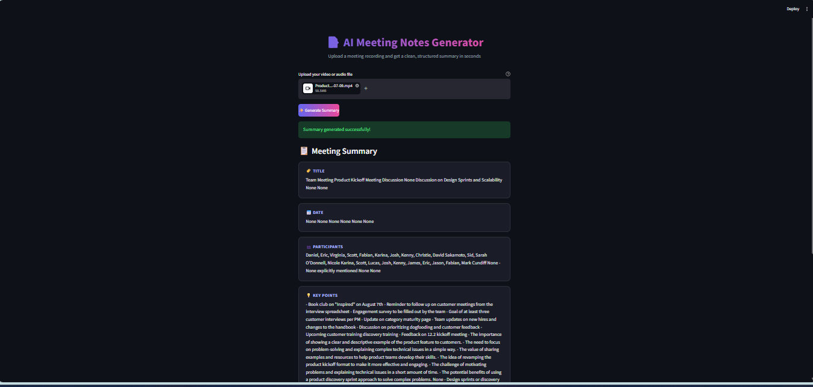
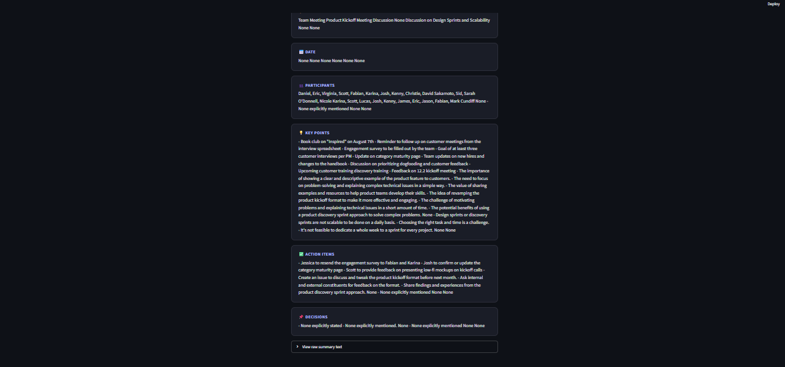

# Ai-Meeting-Summary-Generator

# 📝 AI Meeting Notes Generator

An AI-powered meeting summarization application that converts recorded meeting videos or audio files into clean, structured meeting notes.

The user uploads a meeting recording, the application generates a transcript, and an AI model converts that transcript into an organized meeting summary containing the title, date, participants, key points, action items, and decisions.

---

## 💡 Why I Made This Project

I created this project to solve a real problem that I experienced during my internship.

Sometimes, we are unable to attend an important meeting because of our schedule. Later, we may receive a recording of that meeting, but watching the entire recording can take a lot of time.

For example, a meeting recording can be **30 minutes, 1 hour, 1.5 hours, or even longer**. Going through the complete recording just to understand the important points can be time-consuming.

I faced this situation during my internship when I could not attend some meetings and had to watch the recorded meetings afterward. Instead of spending a long time watching the complete recording, I wanted a system that could understand the meeting and quickly provide the important information.

That is why I built the **AI Meeting Notes Generator**.

The main goal of this project is simple:

> **Turn a long meeting recording into a clean and useful summary so that users can understand the important information without watching the entire meeting.**

---

## 🎯 What Real Problem Does It Solve?

This project helps reduce the time required to understand recorded meetings.

Instead of:

```text
Long Meeting Recording
        ↓
Watch the Complete Video
        ↓
Take Notes Manually
        ↓
Find Important Points
        ↓
Understand the Meeting
```

The application provides:

```text
Long Meeting Recording
        ↓
Automatic Transcription
        ↓
AI Analysis
        ↓
Structured Meeting Summary
        ↓
Quickly Understand the Meeting
```

This can be useful for:

- College meetings
- Internship meetings
- Team meetings
- Project discussions
- Online meetings
- Recorded business discussions

---

## ✨ Features

- 🎥 Upload meeting video or audio recordings
- 📝 Automatic speech-to-text transcription
- 🤖 AI-powered meeting summarization
- 👥 Extract meeting participants
- 💡 Identify important key points
- ✅ Extract action items
- 📌 Identify decisions discussed during the meeting
- 📋 Display the summary in a clean UI
- ⬇️ Download the generated summary as a `.txt` file

---

## 🔄 How the Project Works

```text
Meeting Video / Audio
        │
        ▼
   transcript.py
        │
        │  Generate transcript
        ▼
Generate_summary.py
        │
        │  AI analyzes transcript
        ▼
      Main.py
        │
        │  Display result
        ▼
 Clean Meeting Summary
```

### 1. Upload

The user uploads a recorded meeting video or audio file through the Streamlit interface.

### 2. Transcription

`transcript.py` uploads the media file to Google Gemini and requests a word-for-word transcript.

### 3. Summary Generation

`Generate_summary.py` receives the transcript, splits long transcripts into manageable chunks, and sends them to the Groq-powered LLM to extract structured meeting information.

### 4. Display

`Main.py` connects the workflow and displays the generated information in separate sections.

---

# 🧩 Challenges & Difficulties Faced During Development

Building this project was not only about connecting APIs and an AI model. I also faced several practical problems during development.

## 1. Virtual Environment Activation Issue

One of the first difficulties I faced was with my **Python virtual environment (`venv`)**.

The virtual environment was repeatedly getting disabled or becoming inactive, which caused problems while running the project and its dependencies.

To continue development, I had to activate the environment again through the appropriate user/environment configuration and then activate the Google environment when required.

This taught me the importance of properly managing Python virtual environments and understanding how the development environment affects project execution.

---

## 2. Choosing Between AssemblyAI and Google Gemini

Initially, I used **AssemblyAI** for the audio-to-text transcription part because, in my opinion, it could provide a more accurate transcript.

However, while working with it, i facing many issues that why i switch to Googel Gemini. 

---

## 3. Handling Large Transcripts

Another major difficulty occurred when I initially tried to send the **complete transcript directly to the summarization model**.

For longer meetings, the transcript can become very large. Sending the entire transcript in one request created problems because the model could not reliably handle such a large context in the way I needed.

To solve this problem, I implemented a **chunking approach**.

The transcript is divided into smaller parts, and each part is processed separately by the AI model.

```text
Large Transcript
       ↓
Split into Chunks
       ↓
Chunk 1 → AI
Chunk 2 → AI
Chunk 3 → AI
       ↓
Combine Results
       ↓
Final Meeting Summary
```

This made the summarization process more manageable and reduced the problems caused by very large transcripts.

---


# 📄 Python Files

## `Main.py` — Main Execution File

`Main.py` is the **main execution file** of the project. It creates the Streamlit UI and connects the complete workflow.

It is responsible for:

- Creating the application interface
- Uploading video/audio files
- Calling the transcription function
- Calling the AI summary generator
- Displaying the generated summary
- Providing a download button

The UI organizes the result into **Title, Date, Participants, Key Points, Action Items, and Decisions**.

> **UI Transparency:** The UI design and styling were created with the assistance of AI. This is intentionally mentioned for transparency.

---

## `transcript.py` — Transcript Generation

`transcript.py` handles the transcription stage.

It:

1. Loads the Google API key from `.env`.
2. Initializes the Google GenAI client.
3. Uploads the audio/video file.
4. Waits until the file is ready for processing.
5. Sends the file to Gemini with a transcription instruction.
6. Returns the generated transcript.

The current implementation uses **Gemini 2.5 Flash** for transcription.

---

## `Generate_summary.py` — AI Summary Generation

`Generate_summary.py` converts the transcript into a structured meeting summary.

It:

1. Splits long transcripts into smaller chunks.
2. Sends each chunk to the Groq-powered LLM.
3. Instructs the model not to invent information.
4. Extracts:
   - Title
   - Date
   - Participants
   - Key Points
   - Action Items
   - Decisions
5. Combines the generated results.

The current implementation uses **Llama 3.1 8B Instant** through Groq.

---

# 🖥️ Example Output

The following screenshots are the **actual output of this project** after processing a meeting recording.

### Meeting Summary — Part 1

<p align="center">
  
</p>

### Meeting Summary — Part 2

<p align="center">
  
</p>

### 📋 What the Output Shows

| Section | Description |
|---|---|
| 🏷️ **Title** | Meeting title identified from the transcript |
| 📅 **Date** | Meeting date when available |
| 👥 **Participants** | People mentioned in the meeting |
| 💡 **Key Points** | Important topics and discussions |
| ✅ **Action Items** | Tasks and follow-up activities |
| 📌 **Decisions** | Decisions identified from the meeting |

> **Note:** The screenshots show the real project output. The generated content changes according to the uploaded meeting recording.

---

# 🛠️ Technologies Used

- **Python**
- **Streamlit** — Web UI
- **Google Gemini API** — Audio/video transcription
- **Groq API** — Meeting summary generation
- **LangChain** — LLM prompting and model interaction
- **python-dotenv** — Environment variable management

---

# 🔑 Environment Variables

Create a `.env` file:

```env
GOOGLE_API_KEY=your_google_api_key
GROQ_API_KEY=your_groq_api_key
```

**Never upload your `.env` file or expose your API keys publicly.**

---

# ⚙️ Installation & Setup

### 1. Clone the repository

```bash
git clone <repository-url>
```

### 2. Open the project directory

```bash
cd AI-Meeting-Summary-Generator
```

### 3. Install dependencies

```bash
pip install -r requirements.txt
```

### 4. Add API keys

Create the `.env` file and add your Google and Groq API keys.

### 5. Run the application

```bash
streamlit run Main.py
```

---

# 🚀 Future Improvements

The project is still under development, and I plan to improve it further in future versions.

---

# 👨‍💻 Author

**Rohit Rathod**

Computer Engineering Student | AI & Python Enthusiast

Interested in building AI-powered applications using Python, LLMs, RAG, and modern AI technologies.

---

## ⭐ Support

If you find this project useful, consider giving the repository a ⭐ on GitHub.

