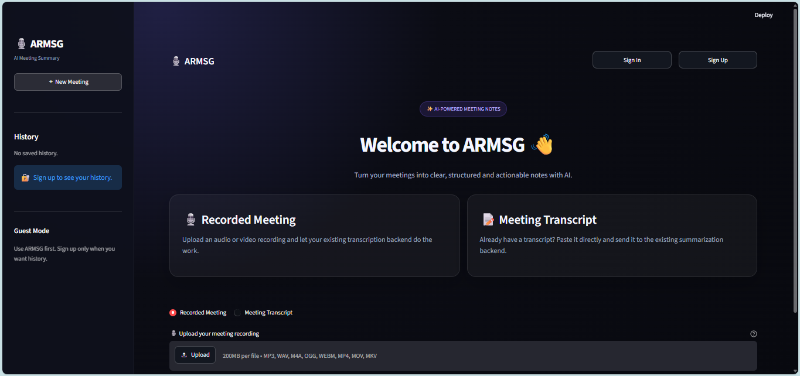
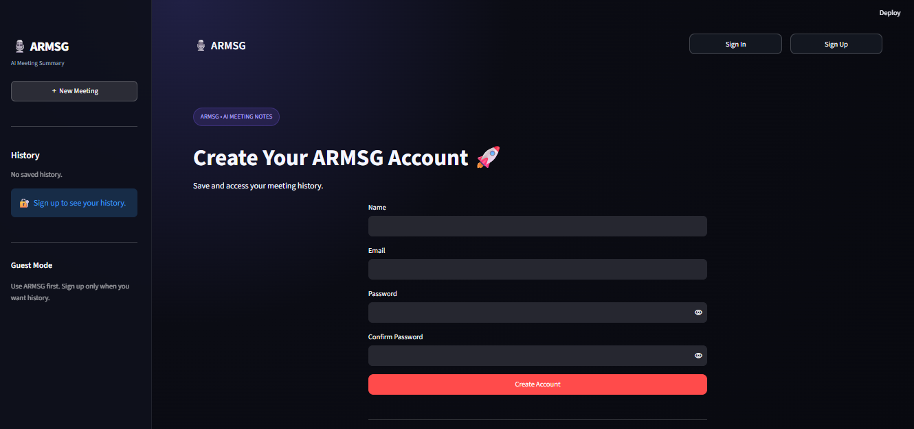
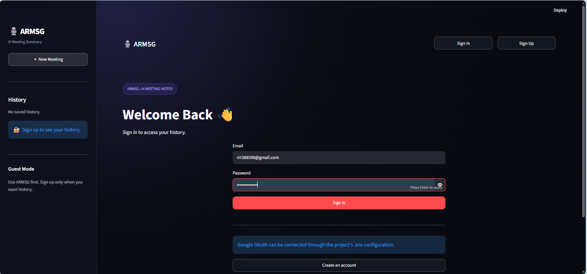
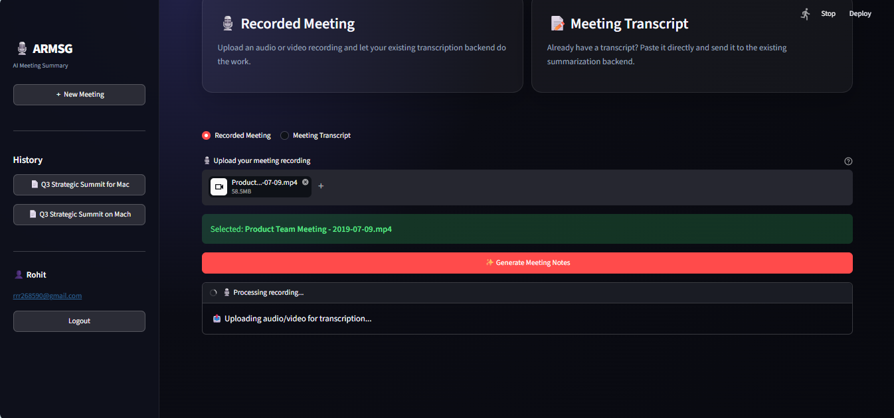
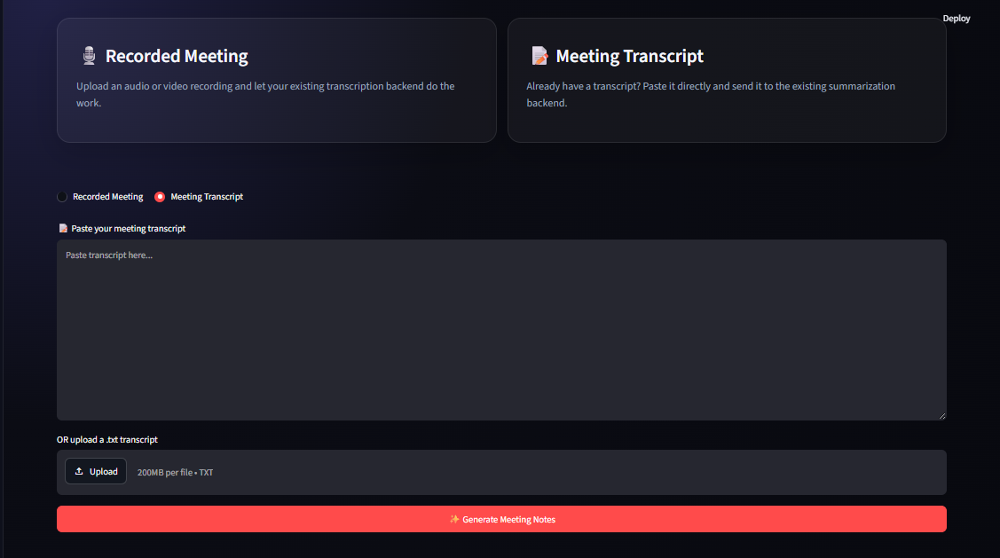
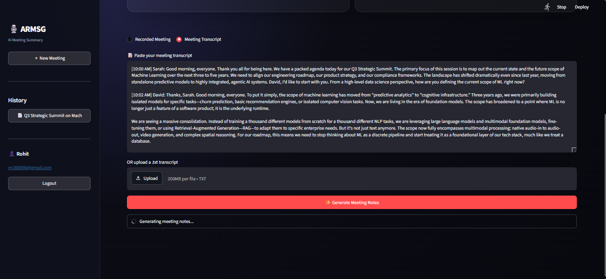
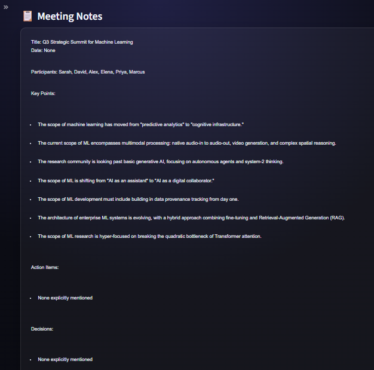
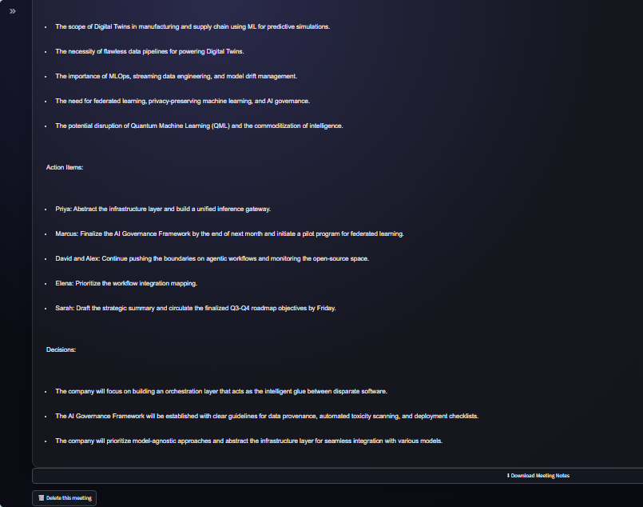

# 🎙️ ARMSG — AI Recorded Meeting Summary Generator

<<<<<<< HEAD
> **Turn long meeting recordings or raw transcripts into clear, structured, and actionable meeting notes with AI.**
=======
# 📝 AI Meeting Summary Generator
>>>>>>> 780061b00d08f1a22eba39f598c7320eff6de96f

ARMSG (**AI Recorded Meeting Summary Generator**) is a Python-based AI application designed to save time when reviewing recorded meetings.

The project started as a recorded-meeting summarizer where a user could upload an audio/video recording and receive a structured summary. It has now been updated to support **two input methods**:

1. 🎙️ **Recorded Meeting** — upload an audio/video recording and let the transcription pipeline generate the transcript automatically.
2. 📝 **Meeting Transcript** — paste an existing transcript or upload a `.txt` transcript and send it directly to the summarization pipeline.

The application also includes guest usage, optional accounts, meeting history, downloadable notes, and a modern Streamlit interface.

---

## 💡 Why I Made This Project

I built ARMSG from a real problem I experienced during my internship.

Sometimes an important meeting cannot be attended because of schedule conflicts. Later, the meeting recording may be available, but watching a **30-minute, 1-hour, 1.5-hour, or longer recording** just to find the important points can take a lot of time.

I faced this situation during my internship. I had to go through recorded meetings that I could not attend, and I wanted a faster way to understand what was discussed, what was decided, and what actions were assigned.

So I created ARMSG with a simple goal:

> **Instead of spending a long time rewatching a meeting, let AI turn the meeting into concise, structured notes.**

---

## 🎯 What Real Problem Does It Solve?

ARMSG reduces the time required to understand recorded meetings and meeting transcripts.

### Traditional approach

```text
Long Meeting Recording
        ↓
Watch the Complete Meeting
        ↓
Take Notes Manually
        ↓
Find Important Discussion Points
        ↓
Remember Decisions & Tasks
```

### ARMSG approach

```text
Meeting Recording / Transcript
              ↓
        Transcription
        (when needed)
              ↓
       AI Summarization
              ↓
      Structured Meeting Notes
              ↓
  Quickly Review Key Information
```

This can be useful for:

- College meetings
- Internship meetings
- Team meetings
- Project discussions
- Online meetings
- Recorded business meetings
- Long meeting transcripts

---

# ✨ Key Features

### 🎙️ Recorded Meeting Mode

Upload a supported audio/video recording and ARMSG sends it through the existing transcription backend before summarization.

Supported media types in the current application include:

`MP3`, `WAV`, `M4A`, `OGG`, `WEBM`, `MP4`, `MOV`, `MKV`

### 📝 Meeting Transcript Mode

Already have a transcript, another conferencing platform, or another transcription tool?

You can:

- Paste the transcript directly into ARMSG
- Upload a `.txt` transcript
- Preview the transcript
- Generate meeting notes without running the audio/video transcription stage

The current interface allows transcript uploads up to **200 MB**.

### 🤖 Structured AI Meeting Notes

The summarizer extracts:

- 🏷️ Title
- 📅 Date
- 👥 Participants
- 💡 Key Points
- ✅ Action Items
- 📌 Decisions

### 👤 Optional User Accounts

Users can use the application in guest mode first.

When they want persistent history, they can create an account and sign in.

The application includes:

- Sign Up
- Sign In
- Logout
- User-specific meeting history
- Delete saved meetings

### 🗂️ Meeting History

Logged-in users can save generated meetings and reopen previous summaries from the sidebar.

Meeting data is stored in JSON files in the current implementation.

### ⬇️ Download Meeting Notes

Generated notes can be downloaded directly as a `.txt` file.

### 🔁 Gemini Retry Handling

The updated application includes retry handling for temporary Gemini `503` / high-demand / unavailable errors during transcription, instead of immediately failing on the first transient error.

---

# 🏗️ Project Architecture

```text
                         ┌──────────────────────┐
                         │        ARMSG         │
                         │    Streamlit UI      │
                         └──────────┬───────────┘
                                    │
                    ┌───────────────┴───────────────┐
                    │                               │
             Recorded Meeting                Meeting Transcript
                    │                               │
                    ▼                               ▼
          Audio_transcript.py              Paste / Upload .txt
                    │                               │
                    ▼                               │
              Google Gemini                        │
             Speech-to-Text                        │
                    │                               │
                    └───────────────┬───────────────┘
                                    ▼
                           Generate_summary.py
                                    │
                                    ▼
                              Groq + LangChain
                                    │
                                    ▼
                          Structured Meeting Notes
                                    │
                     ┌──────────────┴──────────────┐
                     ▼                             ▼
               Download .txt                 Save History
                                                   │
                                                   ▼
                                               JSON Storage
```

---


# 📄 Core Python Files

## `app.py` — Main Execution File

`app.py` is the main execution file of the updated ARMSG project.

It connects the complete application workflow and creates the Streamlit user interface.

Main responsibilities include:

- Application initialization
- Streamlit page layout and custom styling
- Guest mode
- Sign in / sign up flow
- User session management
- Recorded meeting upload
- Meeting transcript input
- `.txt` transcript upload
- Calling the transcription backend
- Calling the AI summarizer
- Meeting history management
- Summary display
- Summary download
- Meeting deletion
- Retry handling for temporary Gemini availability problems

The project also uses JSON files for the current user and meeting-history storage.

## `Audio_transcript.py` — Audio/Video Transcription

This module handles recorded meeting transcription.

The current backend:

1. Loads `GOOGLE_API_KEY`
2. Initializes the Google GenAI client
3. Uploads the media file
4. Waits until Gemini marks the uploaded file as ready
5. Requests a word-for-word transcript
6. Returns the transcript to the application

The current implementation uses **Gemini 2.5 Flash** for transcription.

## `Text_transcript.py` — Text Transcript Input

This helper supports direct text transcript input.

The current function reads transcript text and returns it so the same summarization pipeline can process transcript-based input.

In the updated application, users can also paste the transcript directly in the Streamlit interface or upload a `.txt` transcript.

## `Generate_summary.py` — AI Meeting Summary

This module is responsible for turning the transcript into structured meeting notes.

The current workflow:

1. Split a large transcript into chunks.
2. Send each chunk to the LLM.
3. Extract only information explicitly available in the transcript.
4. Avoid inventing missing information.
5. Return structured sections for the final meeting notes.

The chunking function currently processes approximately **2,200 words per chunk**.

The current summarization model is **Llama 3.1 8B Instant through Groq**, using LangChain prompting.

---

# 🧩 Challenges Faced During Development

Building ARMSG involved several real development challenges.

## 1. Virtual Environment / `venv` Issues

During development, the Python virtual environment repeatedly became disabled or inactive, which caused problems while running the project and its dependencies.

I had to repeatedly activate the environment and manage the correct Python environment before continuing development.

This helped me understand the importance of proper virtual-environment management and dependency isolation in Python projects.

## 2. AssemblyAI vs Google Gemini

Initially, I used AssemblyAI for the audio-to-text transcription part because, in my opinion, it could provide a more accurate transcript.

However, while working with it, i facing many issues that why i switch to Googel Gemini.

## 3. Large Transcript / Context Handling

Initially, I tried sending the complete transcript directly to the summarization model.

For long meetings, the transcript can become very large, which created problems when trying to process the entire context in one request.

I solved this by introducing a **chunking strategy**:

```text
Large Transcript
       ↓
  Split into Chunks
       ↓
Chunk 1 → AI
Chunk 2 → AI
Chunk 3 → AI
       ↓
Combine Responses
       ↓
Final Meeting Notes
```

This makes long transcripts more manageable and reduces the risk of processing failures caused by very large input contexts.

## 4. Temporary Gemini Availability Errors

During recorded-meeting processing, Gemini can temporarily return availability-related errors such as HTTP `503`.

The updated application handles these transient failures by retrying the existing transcription function before showing a final error to the user.

This makes the application more resilient during temporary service overloads.

---

# 🖥️ User Interface

The project uses a dark, modern Streamlit interface designed around a simple workflow.

The UI was created with **AI assistance**, and this is intentionally disclosed for transparency.

## Home Screen

<p align="center">
  
</p>

The home page presents both input options:

- Recorded Meeting
- Meeting Transcript

It also supports guest usage before requiring an account.

## Sign Up

<p align="center">
  
</p>

Users can create an account when they want their meeting history to be saved.

## Sign In

<p align="center">
  
</p>

Registered users can sign in and access their saved meetings.

## Recorded Meeting Input

<p align="center">
  
</p>

Users can upload a meeting recording and start the transcription + summarization workflow.

## Meeting Transcript Input

<p align="center">
  
</p>

Users can paste an existing transcript or upload a `.txt` transcript and send it directly to the summarization backend.

---

# ⚙️ Processing Workflow

When the user selects **Recorded Meeting**:

```text
Upload Recording
      ↓
Temporary File
      ↓
Gemini Transcription
      ↓
Transcript Generated
      ↓
Chunk Transcript
      ↓
Groq LLM
      ↓
Generate Meeting Notes
      ↓
Display + Download
```

When the user selects **Meeting Transcript**:

```text
Paste / Upload Transcript
          ↓
      Transcript
          ↓
    Chunk Transcript
          ↓
       Groq LLM
          ↓
 Generate Meeting Notes
          ↓
      Display + Download
```

### Processing UI

<p align="center">
  
</p>

---

# 📋 Example Output

The screenshots below are real outputs from the project.

## Meeting Notes — Part 1

<p align="center">
  
</p>

## Meeting Notes — Part 2

<p align="center">
  
</p>

The generated notes are organized into sections such as:

- **Title**
- **Date**
- **Participants**
- **Key Points**
- **Action Items**
- **Decisions**

The exact content changes based on the meeting transcript.

---

# 🛠️ Tech Stack

| Technology | Purpose |
|---|---|
| **Python** | Core application logic |
| **Streamlit** | Web interface |
| **Google Gemini** | Audio/video transcription |
| **Groq** | LLM-based meeting summarization |
| **LangChain** | Prompting and LLM integration |
| **bcrypt** | Password hashing |
| **JSON** | Current user and meeting-history storage |
| **python-dotenv** | Environment variable management |

---

# 🔐 Security & Data Handling

The current implementation includes password hashing using **bcrypt** rather than storing plain-text passwords.

API credentials are loaded from environment variables through `.env`.

Example:

```env
GOOGLE_API_KEY=your_google_api_key
GROQ_API_KEY=your_groq_api_key
```

**Never commit `.env` or real API keys to GitHub.**

For production deployment, additional security hardening and a production database would be recommended.

---

# ⚙️ Installation

## 1. Clone the repository

```bash
git clone <your-repository-url>
cd ARMSG
```

## 2. Create a virtual environment

```bash
python -m venv venv
```

## 3. Activate the environment

### Windows

```bash
venv\Scripts\activate
```

### macOS / Linux

```bash
source venv/bin/activate
```

## 4. Install dependencies

```bash
pip install -r requirements.txt
```

## 5. Configure environment variables

Create a `.env` file:

```env
GOOGLE_API_KEY=your_google_api_key
GROQ_API_KEY=your_groq_api_key
```

## 6. Run ARMSG

```bash
streamlit run app.py
```

---

# 📈 Project Evolution

The project has evolved from a simple recorded-meeting summarizer into a more flexible meeting-notes application.

### Earlier version

```text
Recorded Meeting
      ↓
Transcription
      ↓
Summary
```

### Current version

```text
Recorded Meeting ────────┐
                         │
                         ▼
                    ARMSG Summarizer
                         ▲
                         │
Meeting Transcript ──────┘
                         │
                         ▼
               Structured Meeting Notes
```

The major update is the ability to **use an existing meeting transcript directly**, avoiding the transcription step when a transcript is already available.

---

# 🔮 Future Scope

The project is still evolving. Future versions can extend the system with:

- Speaker identification
- Multi-language support
- PDF / DOCX export
- Better meeting analytics
- Calendar integration
- More persistent database storage
- Production-grade authentication
- Advanced search across meeting history
- Improved summary customization

---

# 👨‍💻 Author

**Rohit Rathod**

Computer Engineering Student | AI & Python Enthusiast

Building practical projects with Python, Generative AI, LLMs, and modern AI tools.

---

## ⭐ Support

If you find ARMSG useful or interesting, consider giving the repository a ⭐ on GitHub.
